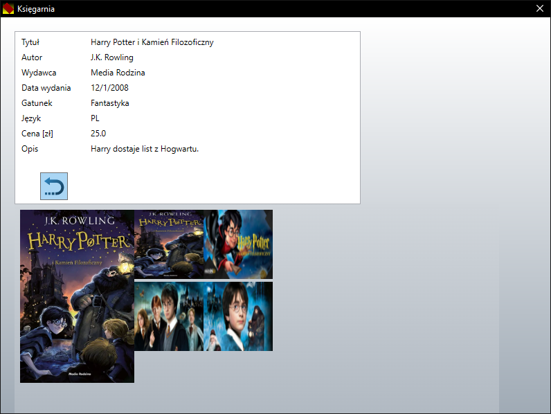

# BookShop
## PL
**Technologie** 
C# 6.0 
WPF, XAML, JavaScript 
Entity Framework, SQLite 

Aplikacja okienkowa do zarządzania książkami.  
Aplikacja jest bogato animowana i stylizowana, gdyż z jednym z celów było zapoznanie się z możliwościami multimedialnymi WPF-a. 
Obrazki obecne w szczegółach książki są wyszukiwane w Internecie na podstawie tytułu. Jeśli pojawi się coś nieodpowiedniego, to wina Binga, a nie moja :)

**Uruchamianie** 
Pobieramy plik BookShop.7z z https://drive.google.com/file/d/1fdbAdYwggC_s3g3slNpulkS5jchsG9zR/view?usp=sharing (plik jest za duży dla GitHuba). Następnie wypakowujemy i uruchamiamy BookShop.exe.  Jeśli nie działa, to zainstaluj .NET 6 SDK.
## EN
**Technologies** 
C# 6.0 
WPF, XAML, JavaScript 
Entity Framework, SQLite 

Window application to books management.  
Application is richly animated and stylized, because one goal was to learn multimedia features of WPF. 
Images in book details is searched in Internet by title. If appeared something unsuitable, it's Bing guilt, not my :)

**Launching** 
Download BookShop.7z from https://drive.google.com/file/d/1fdbAdYwggC_s3g3slNpulkS5jchsG9zR/view?usp=sharing (file is too big for GitHub). Next extract and run BookShop.exe.  If not work, install .NET 6 SDK.

Strona główna 
Main page 

Szczegóły książki 
Book details 

Dodawanie książki 
Book adding 

Szczegóły książki 
Book details 
